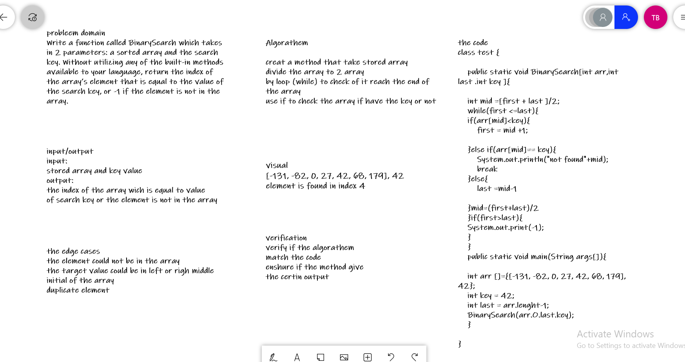

# Array Binary Search
 function called BinarySearch which takes in 2 parameters: a sorted array and the search key. Without utilizing any of the built-in methods available to your language, return the index of the array’s element that is equal to the value of the search key, or -1 if the element is not in the array.

 # the white board
 

# Approach & Efficiency
 I used Binary search to find the due to Since it follows the technique to eliminate half of the array elements, it is more efficient as compared to linear search for large data.
Better time complexity and thus takes less compilation time.

