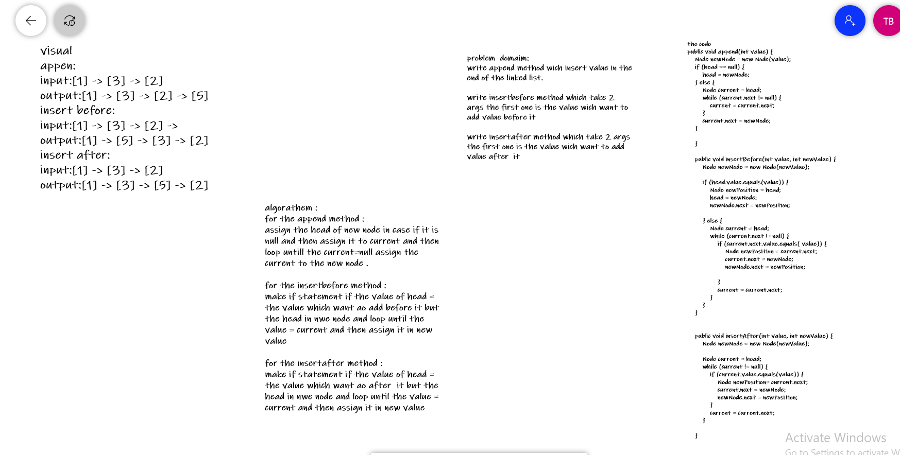

# insertions linked list
write append method wich insert value in the end of the linked list.

write insertbefore method which take 2 args the first one is the value wich want to add value before it

write insertafter method which take 2 args the first one is the value wich want to add value after  it
# Approach & Efficiency
OOP Approach for flexibility and exy to read and fix.
in this approach it not efficient because I use while for add, insert, includes, print.

# white board 

